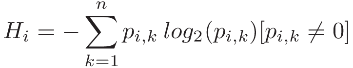
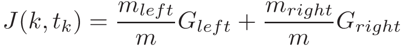

# Decision Trees

## Setup

```shell
$ python -m venv venv
$ pip install -r requirements.txt
```

To start a new Jupyter Notebook kernel:

```shell
$ ipython kernel install --name "local-venv" --user
```

To list all kernels:

```shell
$ jupyter kernelspec list
```

To remove a kernel:

```shell
$ jupyter kernelspec uninstall unwanted-kernel
```

## Decision Tress Backgroudn

### Measures of Impurity

-   **Gini Impurity**


Where p<sub>i,k</sub> is the ratio of class k instances among the training instances in the i<sup>th</sup> node.

Decision trees using Gini Impurity tend to isolate most frequent classes in their own branch in the tree.

-   **Entropy Impurity**



Decision trees using Entropy Impurity create slightly more balanced trees compared to those using Gini Impurity.

### Training Algorithms

-   **CART**

CART Loss function



Where k = single feature, t<sub>k</sub> = threshold.

G<sub>left/right</sub> is the Gini Impurity of the left/right subset

m<sub>left/right</sub> is the number of instances in the left/right subset

-   **ID3**

## Preprocessing Data

## Decision Tree
